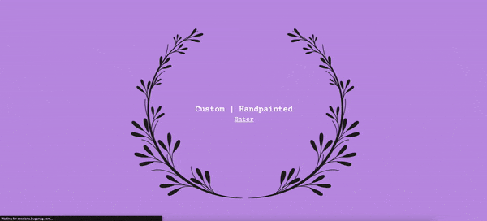

# The Project 
 Nailed by Muna is a simple website build using HTML, CSS, JavaScript, PHP, and styled using some Bootstrap components. This is a volunteer project being built for a home-based nail artist to assist her with keeping track of appointments, along with some additional functionalites.

---

#### Landing Page Demo

---
#### More details coming soon...

